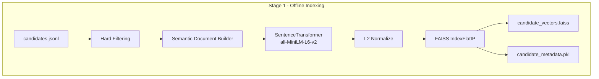
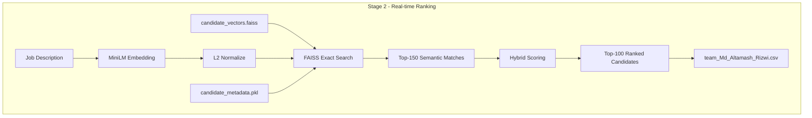
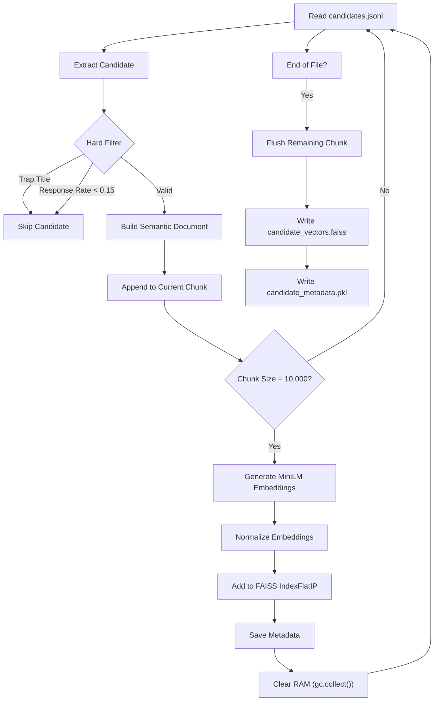
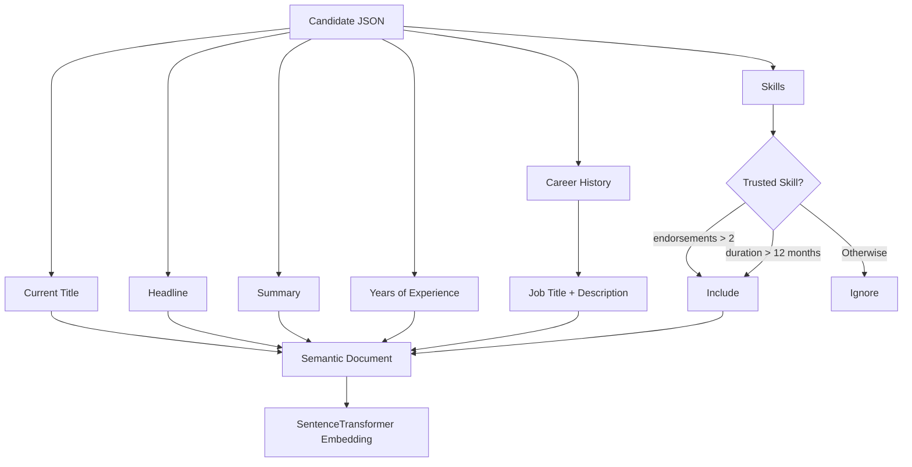
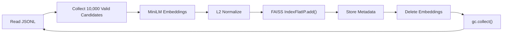
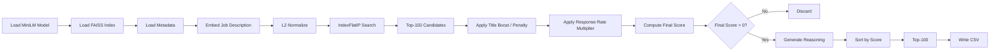
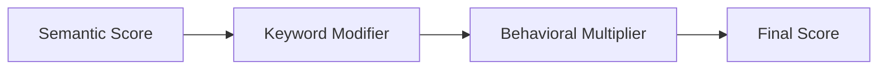
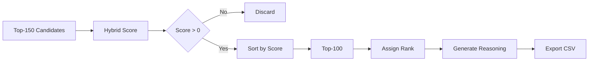

<div align="center">

<h1>💥 Apex Recruiter AI 💥</h1>
<h2>Intelligent Candidate Discovery & Ranking System</h2>

</div>

<p align="center">
  
  
  
  
  
  
</p>

<div align="center">

<h3>A Two-Stage Hybrid Information Retrieval Pipeline for Intelligent Candidate Discovery & Ranking</h3>
<h4>Built for the Redrob Intelligent Candidate Discovery & Ranking Challenge</h4>

</div>

---

# 📖 Overview

Traditional Applicant Tracking Systems (ATS) often rely heavily on keyword matching, making it difficult to identify candidates whose real experience aligns with a job description but whose resumes don't contain the exact keywords.

This repository contains my solution for the **Redrob Intelligent Candidate Discovery & Ranking Challenge**, where the objective was to build an intelligent candidate ranking system capable of evaluating **100,000+ candidate profiles** under strict runtime, memory, and networking constraints.

Instead of depending solely on semantic similarity or keyword matching, my system combines **dense vector retrieval**, **deterministic domain heuristics**, and **behavioral signals** to rank candidates similarly to how an experienced technical recruiter would.

To satisfy the challenge constraints, we designed a **Two-Stage Hybrid Information Retrieval Pipeline**:

- 🧠 Offline semantic indexing using Sentence Transformers
- ⚡ Exact vector retrieval using FAISS (`IndexFlatIP`)
- 📊 Hybrid multi-factor scoring
- 🛡 Early filtering of irrelevant profiles
- 💾 Memory-safe chunk processing
- 🚀 Under 5-second online inference

---

# ✨ Key Features

- 🚀 Two-stage architecture separating indexing from inference
- 🧠 Semantic search using **all-MiniLM-L6-v2**
- ⚡ Exact vector retrieval with **FAISS IndexFlatIP**
- 📊 Hybrid ranking using semantic, heuristic, and behavioral signals
- 🛡 Early filtering of trap and low-quality profiles
- 💾 Memory-safe chunk-based embedding pipeline
- 🔒 Fully offline (No external APIs required)
- 📈 Deterministic ranking with reproducible results
- 📝 Automatic reasoning generation for every ranked candidate
- 🖥 CPU-only execution

---

# 🎯 Problem Statement

Recruiters frequently miss highly qualified candidates because traditional Applicant Tracking Systems primarily depend on keyword matching instead of understanding the actual meaning of a candidate's career history.

The challenge was to build an AI-powered ranking system capable of identifying candidates based on:

- Skills
- Technical expertise
- Career progression
- Relevant experience
- Recruiter engagement

while operating completely offline under strict computational constraints.

---

# ⚠️ Hackathon Constraints

| Constraint | Requirement |
|------------|-------------|
| ⏱ Runtime | ≤ 5 Minutes |
| 💾 Memory | ≤ 16 GB RAM |
| 🌐 Internet | No External API Calls |
| 🖥 Compute | CPU Only |
| 👥 Dataset | 100,000+ Candidate Profiles |
| 🎯 Objective | Return Top 100 Candidates |
| ⚠ Hidden Traps | Keyword Stuffers & Honeypots |

The dataset contains intentionally misleading profiles such as keyword stuffers and candidates with extremely poor recruiter engagement, requiring the system to balance semantic relevance with practical hiring signals.

---

# 💡 Solution Overview

Instead of embedding every candidate during evaluation, I split the pipeline into two independent stages.

## **Stage 1 — Offline Indexing**

Heavy preprocessing is performed only once.

This stage:

- Reads the complete `candidates.jsonl` dataset
- Removes low-value profiles before embedding
- Builds semantic documents
- Generates MiniLM embeddings
- Normalizes vectors
- Stores them inside a FAISS index
- Saves lightweight candidate metadata

The generated artifacts are:

```
candidate_vectors.faiss
candidate_metadata.pkl
```

---

## **Stage 2 — Real-time Candidate Ranking**

This pipeline performs only lightweight operations.

It:

- Embeds the Job Description
- Searches the FAISS index
- Retrieves the Top-150 semantic matches
- Applies deterministic scoring heuristics
- Produces the Top-100 ranked candidates
- Exports the submission CSV

Since embeddings are already precomputed, online execution finishes in only a few seconds.

---

# 🛠 Technology Stack

| Category | Technology |
|----------|------------|
| Language | Python 3 |
| Embedding Model | all-MiniLM-L6-v2 |
| Vector Search | FAISS (`IndexFlatIP`) |
| Data Processing | Pandas |
| Numerical Computing | NumPy |
| Memory Management | Python Garbage Collector (`gc`) |

---

# 📂 Repository Structure

```text

│
├── data/
│   ├── candidates.jsonl
│   ├── sample_candidates.json
│   ├── candidate_schema.json
│   ├── job_description.docx
│   └── ...
│
│
├── sandbox/
│   ├── notebook.ipynb
│   ├── sample_vectors.faiss
│   ├── sample_metadata.pkl
│   └── sandbox_submission.csv
│
│
├── stage1.py                     # Offline indexing pipeline
├── stage2.py                     # Real-time ranking pipeline
│
├── candidate_vectors.faiss       # FAISS vector index
├── candidate_metadata.pkl        # Candidate metadata
│
├── team_Md_Altamash_Rizwi.csv    # Final submission
│
├── requirements.txt
└── README.md
```

---

# 📦 Generated Artifacts

| File | Description |
|------|-------------|
| `candidate_vectors.faiss` | Stores normalized candidate embeddings using FAISS |
| `candidate_metadata.pkl` | Stores metadata required during ranking |
| `team_Md_Altamash_Rizwi.csv` | Final ranked submission |

---

# 🏗️ System Architecture

My solution follows a **Two-Stage Hybrid Information Retrieval (IR) Pipeline**.

Instead of generating embeddings during evaluation (which would exceed the runtime limit), all expensive computation is performed **offline**. During inference, only lightweight embedding generation and vector retrieval are executed.





---

# 🚀 Stage 1 — Offline Candidate Indexing (`stage1.py`)

Stage 1 performs the computationally expensive operations only once.

Its responsibility is to transform more than **100,000 candidate profiles** into a searchable vector database while remaining memory efficient.

Instead of embedding every profile at once, the dataset is processed in **chunks of 10,000 candidates**, ensuring RAM usage remains low throughout execution.

---

# 📌 Stage 1 Pipeline

```text
                            stage1.py

                  candidates.jsonl (100K+ Profiles)
                               │
                               ▼
                     Read JSONL Line-by-Line
                               │
                               ▼
                  Extract Candidate Information
                               │
                               ▼
                    Apply Hard Filtering Rules
                               │
          ┌────────────────────┴────────────────────┐
          │                                         │
          ▼                                         ▼
 Trap Job Titles                           Dead Profiles
(marketing, hr, ...)               recruiter_response_rate < 0.15
          │                                         │
          └────────────────────┬────────────────────┘
                               │
                               ▼
                  Build Semantic Document
                               │
                               ▼
      ┌───────────────────────────────────────────────┐
      │ Current Title                                 │
      │ Headline                                      │
      │ Summary                                       │
      │ Years of Experience                           │
      │ Career History (Title + Description)          │
      │ Trusted Skills                                │
      └───────────────────────────────────────────────┘
                               │
                               ▼
                  Store Inside Current Chunk
                               │
                     (10,000 Candidates)
                               │
                               ▼
              SentenceTransformer (MiniLM-L6-v2)
                               │
                               ▼
                     384-D Embedding Vector
                               │
                               ▼
                        L2 Normalization
                               │
                               ▼
                    Add to FAISS IndexFlatIP
                               │
             ┌─────────────────┴─────────────────┐
             ▼                                   ▼
 candidate_vectors.faiss             candidate_metadata.pkl
```

---

# 🌊 Stage 1 Flowchart



---

# 🛡️ Hard Filtering Strategy

Before generating embeddings, every candidate passes through a lightweight filtering stage.

This significantly reduces unnecessary computation while preventing obviously irrelevant profiles from entering the vector database.

The filtering logic consists of two deterministic rules.

## 1️⃣ Trap Job Titles

Profiles are discarded if the current title belongs to any of the following categories:

```text
marketing
hr
sales
accountant
customer support
graphic designer
content writer
```

These domains are unlikely to satisfy an AI engineering role and therefore do not consume embedding resources.

---

## 2️⃣ Dead Recruiter Profiles

Candidates with

```text
recruiter_response_rate < 0.15
```

are skipped before embedding.

Even if technically relevant, these candidates demonstrate extremely low recruiter engagement and are therefore excluded from the searchable index.

---

# 🧠 Semantic Document Construction

Instead of embedding raw JSON, each candidate is transformed into a structured natural-language document.

This allows the Sentence Transformer to capture semantic relationships across different profile sections.

The semantic document follows this structure:

```text
       Title
 Current Job Title
         ↓
      Headline
         ↓
      Summary
         ↓
 Years of Experience
         ↓
    Career History
(Job Title + Description)
         ↓
   Trusted Skills
         ↓
 Final Semantic Document
```

---

## 🌊 Semantic Document Builder



---

# ⭐ Trusted Skills Selection

Rather than embedding every listed skill, Stage 1 keeps only meaningful skills.

A skill is included when **either** of the following conditions is satisfied:

- Endorsements > **2**
- Duration > **12 months**

This reduces noise from weak or recently added skills while emphasizing long-term expertise.

---

# 💾 Memory-Safe Chunk Processing

Embedding the complete dataset simultaneously would require a large amount of RAM.

Instead, the pipeline processes candidates incrementally using fixed-size chunks.




---

# 📈 Output of Stage 1

After the offline indexing pipeline finishes, two production artifacts are generated.

| Artifact | Purpose |
|-----------|----------|
| **candidate_vectors.faiss** | Stores normalized 384-dimensional embeddings using FAISS IndexFlatIP |
| **candidate_metadata.pkl** | Stores candidate metadata (ID, title, experience, recruiter response rate, honeypot flag) |

These artifacts are consumed directly by **Stage 2**, eliminating the need to regenerate embeddings during inference.

---
---

# ⚡ Stage 2 — Real-time Candidate Ranking (`stage2.py`)

Stage 2 is the production inference pipeline that executes inside the evaluation environment.

Unlike Stage 1, no candidate embeddings are generated here.

Instead, the pipeline loads the precomputed artifacts generated during offline indexing and performs fast candidate retrieval followed by hybrid score refinement.

This design keeps inference lightweight while satisfying the strict runtime requirements of the challenge.

---

# 📌 Stage 2 Pipeline

```text
                        stage2.py

                    Load MiniLM Model
                            │
                            ▼
               Load candidate_vectors.faiss
                            │
                            ▼
               Load candidate_metadata.pkl
                            │
                            ▼
                Read Job Description (JD)
                            │
                            ▼
              Generate JD Embedding (384-D)
                            │
                            ▼
                   L2 Normalize Vector
                            │
                            ▼
              FAISS IndexFlatIP Exact Search
                            │
                            ▼
               Retrieve Top-150 Candidates
                            │
                            ▼
             Candidate-by-Candidate Scoring
                            │
         ┌──────────────────┴──────────────────┐
         ▼                                     ▼
 Keyword Boost/Penalty              Behavioral Multiplier
         │                                     │
         └──────────────────┬──────────────────┘
                            ▼
                   Final Hybrid Score
                            │
                            ▼
                 Remove Invalid Results
                            │
                            ▼
                  Sort by Final Score
                            │
                            ▼
                Select Top-100 Candidates
                            │
                            ▼
               Generate Reasoning Strings
                            │
                            ▼
               team_Md_Altamash_Rizwi.csv
```

---

# 🌊 Stage 2 Flowchart



---

# 🔍 Loading Production Artifacts

The online pipeline begins by loading the artifacts generated during Stage 1.

```python
SentenceTransformer('all-MiniLM-L6-v2')

candidate_vectors.faiss

candidate_metadata.pkl
```

This completely eliminates the expensive embedding generation for candidate profiles during inference.

---

# 🧠 Job Description Embedding

The Job Description is converted into a dense semantic representation using the same embedding model that was used during indexing.

```text
  Job Description
         ↓
  MiniLM Embedding
         ↓
384-Dimensional Vector
         ↓
  L2 Normalization
```

Normalizing both candidate embeddings and the JD embedding allows the inner product returned by FAISS to behave as cosine similarity.

---

# 🔍 Exact Vector Retrieval

Candidate retrieval is performed using

```python
faiss.IndexFlatIP
```

Your implementation uses **exact inner-product search**, not approximate nearest-neighbor search.

The pipeline retrieves

```text
Top-150
```

most semantically similar candidates.

```python
k_retrieval = min(150, len(meta_df))
```

This retrieval acts as the first-stage semantic filter before hybrid scoring.

---

# 🌊 FAISS Retrieval Flow


---

# 🧮 Hybrid Ranking Strategy

Semantic similarity alone cannot distinguish between closely related engineering disciplines.

Therefore, every retrieved candidate passes through a deterministic score refinement stage.

The final ranking combines three independent signals:

```text
1. Semantic Similarity Score
2. Keyword Boost / Penalty
3. Behavioral Multiplier
```

---

# 📐 Final Scoring Formula

```text
Final Score = Semantic Similarity × Keyword Modifier × Behavioral Multiplier
```

Where

```text
Semantic Similarity
```

is the normalized inner-product score returned by FAISS.

---

# 🟢 Keyword Boost

Candidates receive a positive score adjustment when their current title contains one of the following keywords.

| Keyword | Effect |
|----------|--------|
| ai | +15% |
| machine learning | +15% |
| ml | +15% |
| data | +15% |
| backend | +15% |
| recommendation | +15% |
| search | +15% |
| nlp | +15% |

Implemented as

```python
score_modifier += 0.15
```

---

# 🔴 Keyword Penalty

Candidates are penalized if their title belongs to unrelated engineering domains.

| Keyword | Effect |
|----------|--------|
| frontend | -25% |
| ui/ux | -25% |
| mechanical | -25% |
| civil | -25% |
| chemical | -25% |
| hardware | -25% |
| support | -25% |

Implemented as

```python
score_modifier -= 0.25
```

---

# 📈 Behavioral Multiplier

Instead of treating recruiter engagement as a hard ranking feature, the score is smoothly adjusted using recruiter response rate.

The multiplier used in the implementation is

```text
Behavioral Multiplier = 0.8 + 0.2 × recruiter_response_rate
```

This keeps the multiplier within the range

```text
0.80

 ↓

1.00
```

Meaning:

| Recruiter Response Rate | Multiplier |
|--------------------------|------------|
| 0% | 0.80 |
| 25% | 0.85 |
| 50% | 0.90 |
| 75% | 0.95 |
| 100% | 1.00 |

---

# 🌊 Scoring Pipeline



---

# 📝 Reasoning Generation

Each ranked candidate receives a deterministic reasoning string.

The implementation uses the following information:

- Current Title
- Years of Experience
- Recruiter Response Rate

Resulting in reasoning similar to

```text
AI Engineer with 5.2 yrs exp.
Base semantic match adjusted by 92% response rate.
```

The reasoning is generated from metadata and does not rely on any external language model.

---

# 🏆 Candidate Ranking

After computing the final score for every retrieved candidate, the pipeline performs the following operations.

```text
  Top-150 Retrieved
          ↓
  Apply Hybrid Score
          ↓
Discard Invalid Scores
          ↓
   Sort Descending
          ↓
   Select Top-100
          ↓
    Assign Rank
          ↓
    Generate CSV
```

---

# 🌊 Ranking Flowchart



---

# 📄 Final Output

The submission is exported as

```text
team_Md_Altamash_Rizwi.csv
```

with the following columns.

| Column | Description |
|----------|-------------|
| candidate_id | Candidate Identifier |
| rank | Final Rank |
| score | Hybrid Score |
| reasoning | Deterministic Explanation |

---

# ⚡ Runtime Characteristics

| Operation | Runtime |
|------------|----------|
| Load MiniLM | <5 Seconds |
| Embed JD | <1 Second |
| FAISS Search | Few Milliseconds |
| Hybrid Scoring | Few Milliseconds |
| CSV Generation | Negligible |

Typical end-to-end runtime:

```text
≈ 9 Seconds
```

well below the hackathon limit.

---
---

# ⚙️ Engineering Decisions

Building an effective candidate ranking system under strict runtime, memory, and networking constraints required several engineering trade-offs. Rather than optimizing for model complexity alone, the system was designed to maximize practical retrieval quality while remaining lightweight and deterministic.

---

## 🎯 Why a Two-Stage Architecture?

Generating embeddings for more than **100,000 candidate profiles** during evaluation would significantly exceed the runtime budget.

To eliminate this bottleneck, the pipeline separates expensive computation from online inference.

| Stage | Responsibility |
|--------|----------------|
| **Stage 1** | Offline preprocessing, semantic document construction, embedding generation, and FAISS indexing |
| **Stage 2** | Job Description embedding, candidate retrieval, hybrid scoring, and CSV generation |

This separation allows inference to complete in only a few seconds.

---

## 💾 Why Chunk-Based Processing?

Loading and embedding the complete dataset at once would unnecessarily increase memory consumption.

Instead, Stage 1 processes candidates in **fixed-size chunks (10,000 profiles)**.

Advantages:

- Lower peak memory usage
- Stable execution on CPU
- Continuous indexing without storing all embeddings simultaneously
- Explicit garbage collection after every chunk

---

## 🔍 Why FAISS `IndexFlatIP`?

The project uses

```python
faiss.IndexFlatIP
```

instead of approximate indexes such as IVF or HNSW.

Reasons:

- Exact similarity search
- No training phase required
- Deterministic results
- Simpler deployment
- Suitable for the dataset size used in this challenge

Since all embeddings are L2-normalized before indexing, the inner product returned by FAISS behaves as cosine similarity.

---

## 🧠 Why Sentence Transformers?

The selected embedding model is

```text
all-MiniLM-L6-v2
```

because it provides an excellent balance between:

- Embedding quality
- CPU inference speed
- Small model size
- Production readiness

This makes it particularly suitable for offline semantic indexing.

---

## 📄 Why Build a Semantic Document?

Instead of embedding raw JSON objects, the system converts each candidate profile into a structured natural-language document.

The semantic document combines:

- Current Title
- Headline
- Summary
- Years of Experience
- Career History
- Trusted Skills

This enables the embedding model to capture richer semantic relationships than isolated fields.

---

## 🛡️ Why Filter Before Embedding?

Embedding generation is the most computationally expensive operation in the pipeline.

By removing obviously irrelevant candidates before embedding, the system:

- Reduces unnecessary computation
- Keeps the vector database cleaner
- Improves retrieval quality
- Saves CPU time

The filtering rules are deterministic and based on profile titles and recruiter engagement.

---

# 📈 Performance Summary

| Metric | Value |
|--------|-------|
| Embedding Model | all-MiniLM-L6-v2 |
| Embedding Dimension | 384 |
| Vector Database | FAISS IndexFlatIP |
| Processing Mode | CPU Only |
| Chunk Size | 10,000 Candidates |
| Retrieval Count | Top-150 |
| Final Output | Top-100 |

---

# ⏱ Runtime Analysis

### Stage 1

| Task | Description |
|------|-------------|
| Read Dataset | Parse candidate JSONL |
| Filtering | Remove low-value candidates |
| Embedding | MiniLM encoding |
| Indexing | FAISS vector insertion |
| Artifact Generation | Save FAISS + Metadata |

This stage is executed only once.

---

### Stage 2

| Task | Approximate Cost |
|------|------------------|
| Load Model | Low |
| Embed JD | Very Low |
| FAISS Search | Very Low |
| Hybrid Scoring | Very Low |
| CSV Generation | Negligible |

Typical execution time:

```text
≈ 9 Seconds
```

---

# ⚙️ Computational Complexity

### Stage 1

| Operation | Complexity |
|-----------|------------|
| JSON Parsing | O(N) |
| Semantic Document Construction | O(N) |
| Embedding Generation | O(N) |
| FAISS Index Construction | O(N) |

---

### Stage 2

| Operation | Complexity |
|-----------|------------|
| JD Embedding | O(1) |
| FAISS Search (IndexFlatIP) | O(N × d) |
| Hybrid Scoring | O(K) |
| Sorting | O(K log K) |

where

- **N** = Number of indexed candidates
- **d** = Embedding dimension (384)
- **K** = Retrieved candidates (150)

---

# ▶️ Getting Started

## Clone the Repository

```bash
git clone https://github.com/rizzz-altamash/Apex-Recruiter-AI.git
cd Apex-Recruiter-AI
```

---

## Install Dependencies

```bash
pip install -r requirements.txt
```

---

## Project Structure

Place the dataset inside:

```text
data/
```

Required files:

```text
data/
├── candidates.jsonl
├── sample_candidates.json
├── job_description.docx
└── ...
```

---

# 🚀 Running the Pipeline

## Step 1 — Offline Indexing

```bash
python stage1.py
```

Generated artifacts:

```text
candidate_vectors.faiss

candidate_metadata.pkl
```

---

## Step 2 — Candidate Ranking

```bash
python stage2.py
```

Generated output:

```text
team_Md_Altamash_Rizwi.csv
```

---

# 📄 Output Format

The generated CSV contains:

| Column | Description |
|----------|-------------|
| candidate_id | Candidate identifier |
| rank | Final ranking position |
| score | Hybrid ranking score |
| reasoning | Deterministic explanation |

Example:

| candidate_id | rank | score | reasoning |
|--------------|------|--------|-----------|
| CAND_0005260 | 1 | 0.839 | Senior NLP Engineer with 5.2 yrs exp. Base semantic match adjusted by 86% response rate. |

---

# 🔮 Future Improvements

Possible enhancements include:

- Support for multiple Job Descriptions
- Metadata-aware retrieval
- Cross-encoder re-ranking
- Query expansion
- Learning-to-Rank models
- Domain-specific embedding models
- FAISS IVF/HNSW indexes for larger datasets
- Configurable scoring weights
- Interactive recruiter dashboard

---

# 🌟 Project Highlights

- ✅ Two-stage retrieval architecture
- ✅ Offline semantic indexing
- ✅ Memory-safe chunk processing
- ✅ Structured semantic document generation
- ✅ Exact vector retrieval using FAISS
- ✅ Hybrid scoring strategy
- ✅ Deterministic ranking
- ✅ CPU-only execution
- ✅ Fully offline pipeline
- ✅ Reproducible results

---

# 🙌 Acknowledgements

This project was developed as part of the **Redrob - Intelligent Candidate Discovery & Ranking Challenge**.

Open-source technologies used:

- Sentence Transformers
- FAISS
- NumPy
- Pandas
- Python

---

# 📬 Contact

**Md Altamash Rizwi**

🌐 Portfolio --- https://rizwi.in

📧 Email ------- rizzzaltamash@gmail.com

🐙 GitHub ------ https://github.com/rizzz-altamash

💼 LinkedIn ---- https://www.linkedin.com/in/md-altamash-rizwi-1865b2322/

---

<div align="center">

## ⭐ If you found this project interesting, consider giving it a star!

Built with ❤️ for **Redrob**

</div>